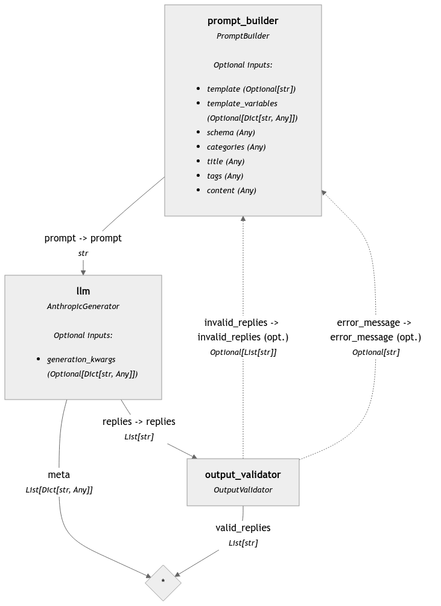

# WordPress.com Blog Metadata Organizer

This project aims to enhance WordPress.com blog content by organizing taxonomy, generating tags and categories, and creating internal links between related posts using natural language processing and machine learning techniques.

## Project Structure

- `src/`: Contains the source code for the project.
  - `auth/`: Authentication related code.
  - `notebooks/`: Jupyter notebooks for data analysis, experimentation, and model building.
  - `utils/`: Utility functions and helpers.
- `data/`: Contains the data used for the project.

## Setup

1. Clone this repository
2. Create a `.env` file in the root directory based on `.env.example`
3. Install required packages using Poetry: `poetry install`

## Usage

1. Obtain WordPress.com API credentials and set up an app (see [WordPress.com API documentation](https://developer.wordpress.com/docs/))
2. Get an Anthropic API key for Claude 3.5
3. Run `auth_get_token.py` to obtain an access token
4. Execute notebooks in the following order:
   - `organize_metadata.ipynb`
   - `llm_taxonomy_update.ipynb`
   - `generate_new_links.ipynb`

## Notebooks

### organize_metadata.ipynb
Explores existing taxonomy of categories and tags using SentenceTransformer for content analysis.
In this notebook I analyzed the current content structure, generated word embeddings for posts, and used clustering techniques to identify potential new categories and tags. We found semantically similar tags and merged them. The output is a set of 10 categories and 50 tags that better represent the blog's content, providing a foundation for improved content organization.
I used different language models, like the small and fast `all-MiniLM-L6-v2`, as well as a higher performing, but slower `dunzhang/stella_en_1.5B_v5`.

### llm_taxonomy_update.ipynb
Uses a Language Model (LLM) to generate tags and categories for each post based on the output from the previous step.
This notebook implements a custom pipeline that processes each blog post, sends it to the LLM (Claude 3.5 Sonnet), and receives suggested categories, tags, and keywords. It includes error handling and validation to ensure the LLM output meets the required format. The notebook also includes functionality to update the WordPress.com posts with the new taxonomy via API calls.
As LLM models I used `anthropic` and `ollama`. Claude 3.5 Sonnet is a more powerful model and Ollama is a smaller and faster model. Both models were pretty good at generating new tags and categories. But the local model I used had issues generating the JSON schema output. No issues with Claude 3.5 Sonnet. It costed around $2 to update the taxonomy of 100 posts.

### generate_new_links.ipynb
Utilizes SentenceTransformer to find related posts and sends pairs to LLM for generating internal links between posts.
This notebook creates embeddings for each post's content, computes similarity scores between posts, and identifies potential pairs for linking. It then uses the LLM to generate contextually appropriate link suggestions, including the anchor text and placement within the source post. The notebook also includes functionality to update the posts with these new internal links, improving the blog's interconnectivity and user navigation.
In this notebook also I used `anthropic` and `ollama`. Again I observed higher quality results with Claude 3.5 Sonnet. It costed around $1 to generate the new links for 23 post pairs.

Pipeline of llm_taxonomy_update.ipynb looks as the following. We see the loop on the output validation.

## About data.blog

This project is based on real work done for [data.blog](https://data.blog), the official blog of Automattic's data team. data.blog serves as a platform for Automattic's data scientists, analysts, and engineers to share insights, methodologies, and learnings from their work in the data field.

data.blog covers a wide range of topics including:

- Data science and machine learning applications
- Analytics and experimentation at scale
- Insights into distributed work in data teams
- Technical deep dives into data engineering and infrastructure
- Reflections on data ethics and responsible AI

By enhancing the content organization and discoverability of data.blog, this project aims to make it easier for readers to find relevant articles, explore related topics, and gain a deeper understanding of data science in action at Automattic.

We encourage you to visit [data.blog](https://data.blog) to see these improvements in action and to explore the wealth of data-related content shared by Automattic's data team.

This project serves as a practical example of how natural language processing and machine learning techniques can be applied to enhance content organization and user experience in a production environment.

## License

This project is licensed under the MIT License - see the [LICENSE](LICENSE) file for details.
